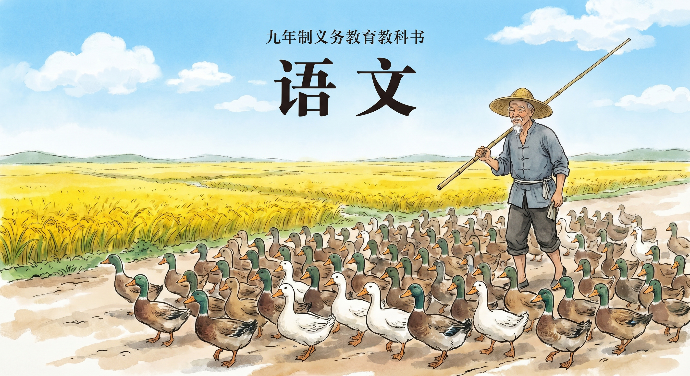

Duckman: DuckDB version manager and toolchain
=============================================

Duckman(赶鸭人) is a DuckDB version manager and toolchain CLI.



Features:

1. Install/Uninstall DuckDB with different versions
2. List installed/remote DuckDB
3. Run duckdb with a specific version of DuckDB and profile
4. Extension Manager: install/uninstall/update/migrate extensions
5. Profile Manager: secrets, S3, required extensions etc.
6. MotherDuck integration
7. DuckLake integration
8. Iceberg integration
9. dotenv support: `.env` autoload into environment variables for `getenv('XXX')`
10. Duckman shim: a wrapper for DuckDB executable, it is used to switch DuckDB version and profile

## profiles

Profile is a collection of settings to run DuckDB.

- basic info: name, description, DuckDB version
- required extensions
- secrets
- environment variables
- S3 bucket list
- attached db
- ducklake
- parquet key

If profile name is `default`, and it means that this profile will be used as the default profile when running DuckDB.

Fore more information about profile, please refer [Duckman Config](duckman-config.md).

# extension sub command

- install/uninstall extension
- list extensions
- init: create a new extension with Rust/C++

# Environment variable

- `DUCKDB_VERSION`: default DuckDB version to use
- `DUCKDB_PROFILE`: default profile to run DuckDB

# FAQ

### How does Duckman choose DuckDB version?

- option first: `--duckdb 1.5.2`
- environment variable: `DUCKDB_VERSION`
- profile default: `duckdb_version` in profile
- global default: `default` in config file

Or you can create `.env` file with environment variables:

```
DUCKDB_VERSION=v1.5.2
```

### How to migrate extensions from DuckDB v1.4.4 to v1.5.2?

Migration is not real one, just install the extensions on new DuckDB version.

```shell
$ duckman --duckdb 1.5.2 ext migrate 1.4.4
```

### How to install DuckDB for Duckman from local zip file?

```
$ unzip -d $HOME/.duckdb/versions/v1.5.2 duckdb_cli-osx-amd64.zip
```

### How to install DuckDB from local path?

```
$ duckman install ~/Downloads/duckdb
```

### How to install DuckDB from PATH environment?

```
$ duckman install system
```

### How does Duckman choose profile?

- option first: `--profile xxx`
- environment variable: `DUCKDB_PROFILE`

Or you can create `.env` file with environment variables:

```
DUCKDB_PROFILE=xxx
```

### What is Duckman shim?

Duckman shim is a wrapper for DuckDB executable, it is used to switch DuckDB version and profile.

```
$ ln -s /path/to/duckman.shim ~/bin/duckdb
$ ~/bin/duckdb --version
```

### How to add MontherDuck support?

```toml
[profile.analytics.environment]
MOTHERDUCK_TOKEN = "xxxx"

[profile.analytics.attached.mydb]
path = "md:mydb"
```

### How to add Iceberg support?

```toml
[profile.analytics.secret.iceberg_secret]
type = "iceberg"
token = "bearer_token"

[profile.analytics.attached.myberg]
type = "iceberg"
path = "warehouse"
options = { SECRET = "iceberg_secret", ENDPOINT = "https://rest_endpoint.com" }
```

# References

* DuckDB: https://duckdb.org/
* DuckLake: https://ducklake.select/
* MotherDuck: https://motherduck.com/